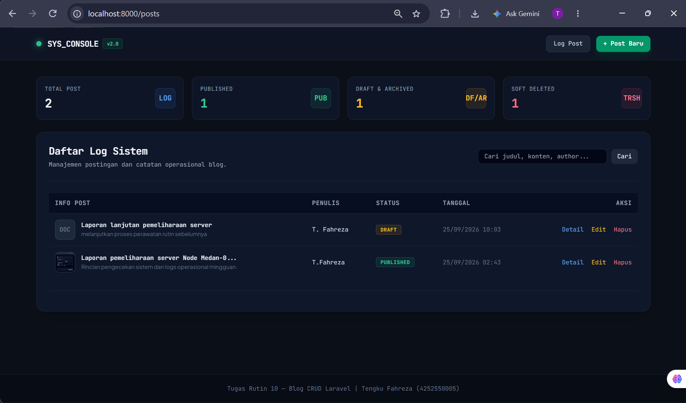
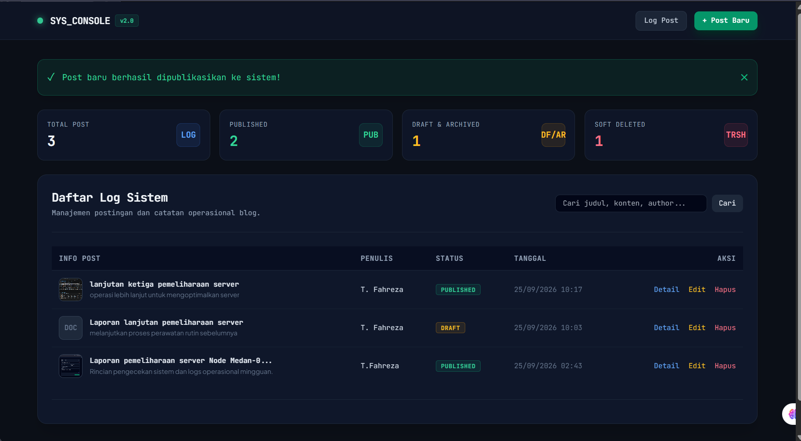
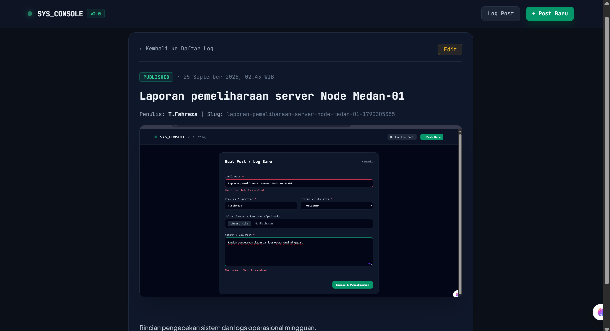
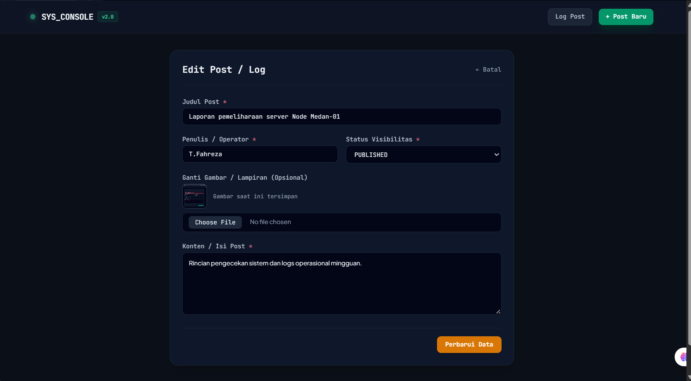
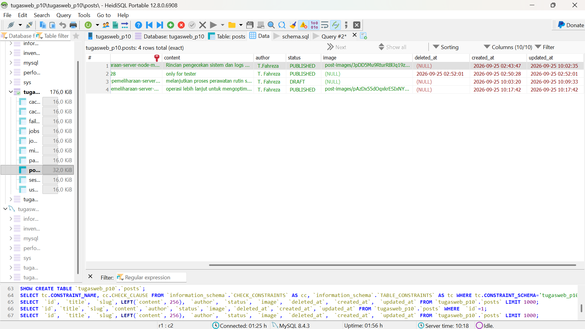

# 🚀 Tugas Rutin 10 — Blog CRUD Engine (SYS_CONSOLE)

[](https://laravel.com)
[](https://php.net)
[](https://tailwindcss.com)
[](https://mysql.com)

Aplikasi Web **Blog / Log Operations Management System** berbasis Laravel yang dibangun untuk memenuhi kriteria pengerjaan **Tugas Rutin 10 (TR 10)**. Aplikasi ini mengusung tema antarmuka *Dashboard Console/Operations Modern*, menerapkan prinsip arsitektur MVC secara disiplin, dilengkapi validasi input tingkat lanjut, manajemen penyimpanan berkas media, serta fitur *advanced* seperti **Search Scope** dan **Soft Deletes**.

---

## 🔗 Tautan Repositori

- **GitHub Repository:** [TugasWeb-P10-BlogCRUD](https://github.com/tengkufahreza6-dev/TugasWeb-P10-BlogCRUD)

---

## 👤 Informasi Mahasiswa

- **Nama Mahasiswa:** Tengku Fahreza
- **NIM:** 4252550005
- **Program Studi:** Ilmu Komputer
- **Mata Kuliah:** Pemrograman Web
- **Instansi:** Universitas Negeri Medan (UNIMED)
- **Repositori:** `TugasWeb-P10-BlogCRUD`
- **Database Target:** `tugasweb_p10`

---

## 📋 Matriks Pemenuhan Kriteria & Rubrik Penilaian

Berikut adalah pemetaan implementasi teknis terhadap seluruh poin kriteria yang disyaratkan pada **Slide Modul Pertemuan 10**:

| No | Persyaratan Rubrik TR 10 | Status | File / Komponen Implementasi Utama |
|---|---|:---:|---|
| 1 | `Route::resource('posts')` + Named Routes | 🟢 **100%** | `routes/web.php` |
| 2 | `PostController` Resource (7 Methods) | 🟢 **100%** | `app/Http/Controllers/PostController.php` |
| 3 | Blade Layout Master (`@extends` / `@yield`) | 🟢 **100%** | `resources/views/layouts/app.blade.php` |
| 4 | Minimal 2 Blade Components Reusable | 🟢 **100%** | `<x-alert>` (`alert.blade.php`) & `<x-card>` (`card.blade.php`) |
| 5 | Validasi Form + Error per Field + `@old()` | 🟢 **100%** | Form `create.blade.php` & `edit.blade.php` |
| 6 | Flash Message Sukses / Gagal | 🟢 **100%** | Session Flash Notification via `PostController` & `<x-alert>` |
| 7 | Keamanan Form (`@csrf`, `@method('PUT/DELETE')`) | 🟢 **100%** | Seluruh Form Blade di `resources/views/posts/` |
| 8 | Route Model Binding + Pagination | 🟢 **100%** | `PostController::paginate(5)` & Dynamic Route Binding |
| ⭐ | **Bonus 1:** Fitur Pencarian (Search) | 🟢 **100%** | Local Scope `scopeFilter()` di Model `app/Models/Post.php` |
| ⭐ | **Bonus 2:** Soft Deletes | 🟢 **100%** | Trait `SoftDeletes` di Model & Kolom `deleted_at` di Migration |
| ⭐ | **Bonus 3:** Upload Gambar / Lampiran | 🟢 **100%** | `Illuminate\Support\Facades\Storage` & Link Public Symlink |

---

## 🖼️ Tampilan Antarmuka & Tangkapan Layar (Screenshots)

### 1. Dashboard Utama & Tabel Log Sistem
Menampilkan 4 kartu statistik operasional (*Total Post, Published, Draft/Archived, Soft Deleted*), baris pencarian, tabel data log dengan thumbnail, lencana status, serta navigasi pagination.


### 2. Form Tambah Post Baru (`/posts/create`) & Validasi Error
Form interaktif pembuatan postingan dengan opsi upload gambar lampiran. Dilengkapi pesan peringatan validasi *error per field* dan penanganan re-fill data `@old()`.


### 3. Detail Post (`/posts/{id}`)
Menampilkan rincian postingan menggunakan *Route Model Binding*, menampilkan media lampiran resolusi tinggi, meta-data penulis, slug otomatis, serta format waktu WIB.


### 4. Form Edit Post (`/posts/{id}/edit`)
Form pembaruan data yang mendukung penggantian berkas gambar lama, penanganan method spoofing `@method('PUT')`, dan pembaruan slug otomatis.


### 5. Verifikasi Soft Delete di Database (HeidiSQL)
Bukti eksekusi *Soft Delete*. Data yang dihapus dari tampilan web tetap tersimpan utuh secara aman di dalam tabel `posts` MySQL dengan terisinya kolom timestamp `deleted_at`.


---

## 📂 Structure Directory Proyek

Struktur direktori utama proyek `TugasWeb-P10-BlogCRUD` yang merepresentasikan implementasi MVC dan komponen pendukungnya secara detail:

```text
TugasWeb-P10-BlogCRUD/
├── app/
│   ├── Http/
│   │   └── Controllers/
│   │       ├── Controller.php
│   │       └── PostController.php      # Controller Resource (7 Methods + Storage Logic)
│   └── Models/
│       └── Post.php                    # Model Post (Fillable, SoftDeletes, & Scope Filter)
├── config/
│   ├── app.php                         # Config Timezone ('Asia/Jakarta')
│   └── filesystems.php                 # Config Storage Link
├── database/
│   ├── migrations/
│   │   └── xxxx_xx_xx_xxxxxx_create_posts_table.php  # Schema Tabel Posts + SoftDeletes
│   └── seeders/
│       └── DatabaseSeeder.php          # Seeder Data Awal Pengujian
├── public/
│   └── storage -> ../storage/app/public  # Symbolic Link untuk Berkas Gambar Upload
├── resources/
│   └── views/
│       ├── components/                 # Reusable Blade Components
│       │   ├── alert.blade.php         # Komponen Notifikasi Flash Message
│       │   └── card.blade.php          # Komponen Wrapper Kontainer UI
│       ├── layouts/
│       │   └── app.blade.php           # Master Layout Template (@extends & @yield)
│       └── posts/                      # Views CRUD Post Utama
│           ├── create.blade.php        # Form Tambah Data + Validasi
│           ├── edit.blade.php          # Form Edit Data + Upload Replacement
│           ├── index.blade.php         # List Table + Dashboard Stats + Search Form
│           └── show.blade.php          # Detail View Log
├── routes/
│   └── web.php                         # Route Resource Definition (Route::resource)
├── storage/
│   └── app/
│       └── public/
│           └── post-images/            # Direktori Penyimpanan Berkas Upload Gambar
├── .env                                # Konfigurasi Environment & Database MySQL
├── composer.json                       # Dependensi Paket Laravel
└── README.md                           # Dokumentasi Resmi Proyek
```

---

## ⚡ Langkah-Langkah Instalasi & Jalankan Proyek

Jika Anda ingin menjalankan proyek ini di lingkungan lokal baru, ikuti petunjuk berikut:

### 1. Clone Repositori
```bash
git clone https://github.com/tengkufahreza6-dev/TugasWeb-P10-BlogCRUD.git
cd TugasWeb-P10-BlogCRUD
```

### 2. Instal Dependensi Composer
```bash
composer install
```

### 3. Konfigurasi File Environment `.env`
Salin file `.env.example` menjadi `.env`:
```bash
cp .env.example .env
```
Buka file `.env` dan sesuaikan konfigurasi koneksi database MySQL:
```env
APP_NAME="SYS_CONSOLE Blog Engine"
APP_URL=http://localhost:8000

DB_CONNECTION=mysql
DB_HOST=127.0.0.1
DB_PORT=3306
DB_DATABASE=tugasweb_p10
DB_USERNAME=root
DB_PASSWORD=
```

### 4. Generate Application Key
```bash
php artisan key:generate
```

### 5. Jalankan Migrasi Database & Seeder
Pastikan MySQL di Laragon / XAMPP sudah aktif, lalu jalankan:
```bash
php artisan migrate --seed
```

### 6. Hubungkan Storage Link (Wajib untuk Feature Gambar)
Jalankan perintah ini agar gambar yang diunggah ke folder `storage` dapat diakses langsung oleh browser melalui folder `public`:
```bash
php artisan storage:link
```

### 7. Jalankan Server Lokal
```bash
php artisan serve
```
Akses aplikasi melalui browser di alamat: **`http://localhost:8000`** atau **`http://127.0.0.1:8000`**.

---

## 🔐 Ringkasan Keamanan & Fitur Terintegrasi

1. **CSRF Protection:** Seluruh form HTTP (POST, PUT, DELETE) dilindungi oleh direktif `@csrf` guna mencegah serangan *Cross-Site Request Forgery*.
2. **Method Spoofing:** Menggunakan `@method('PUT')` pada form sunting dan `@method('DELETE')` pada form hapus sesuai dengan standar RESTful Route Resource Laravel.
3. **Validasi Server-Side:** Validasi input ketat pada `PostController` dengan aturan `required`, `max`, `in`, serta batas maksimal *file upload* gambar 2MB (`max:2048`).
4. **Keamanan File Upload:** Gambar disimpan menggunakan enkripsi penamaan acak otomatis oleh Laravel Storage API di dalam direktori `storage/app/public/post-images`.

---

© 2026 **SYS_CONSOLE** — Tugas Rutin 10 Pemrograman Web | *Tengku Fahreza (4252550005)*